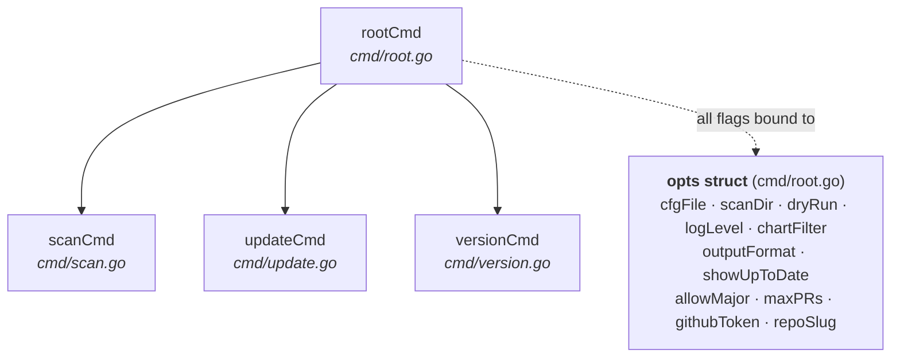
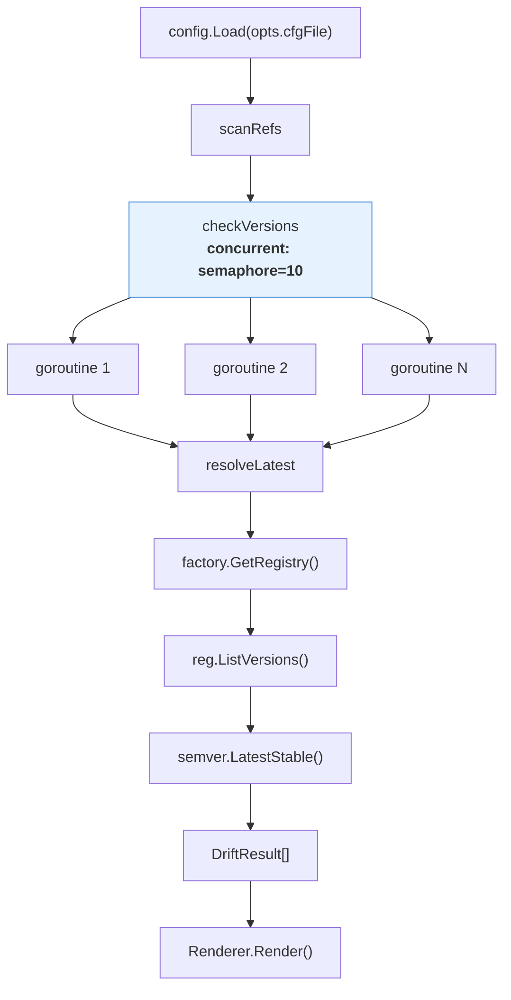
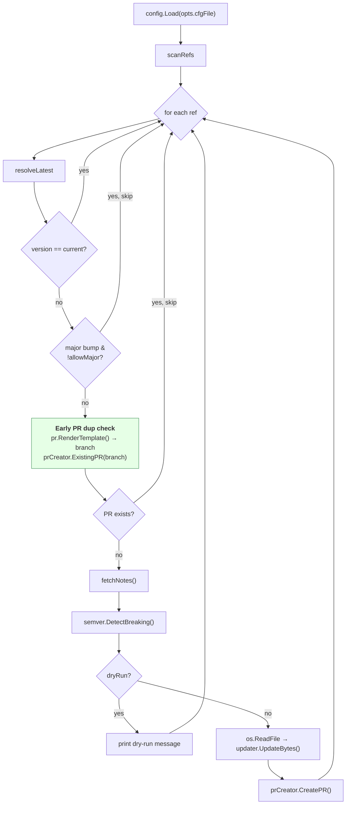
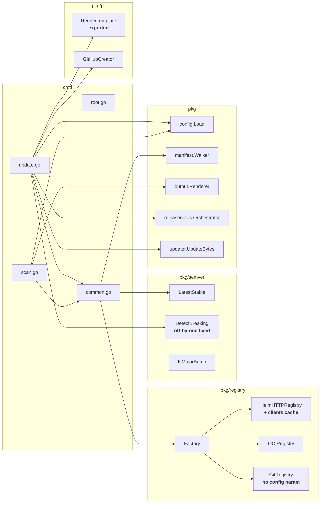
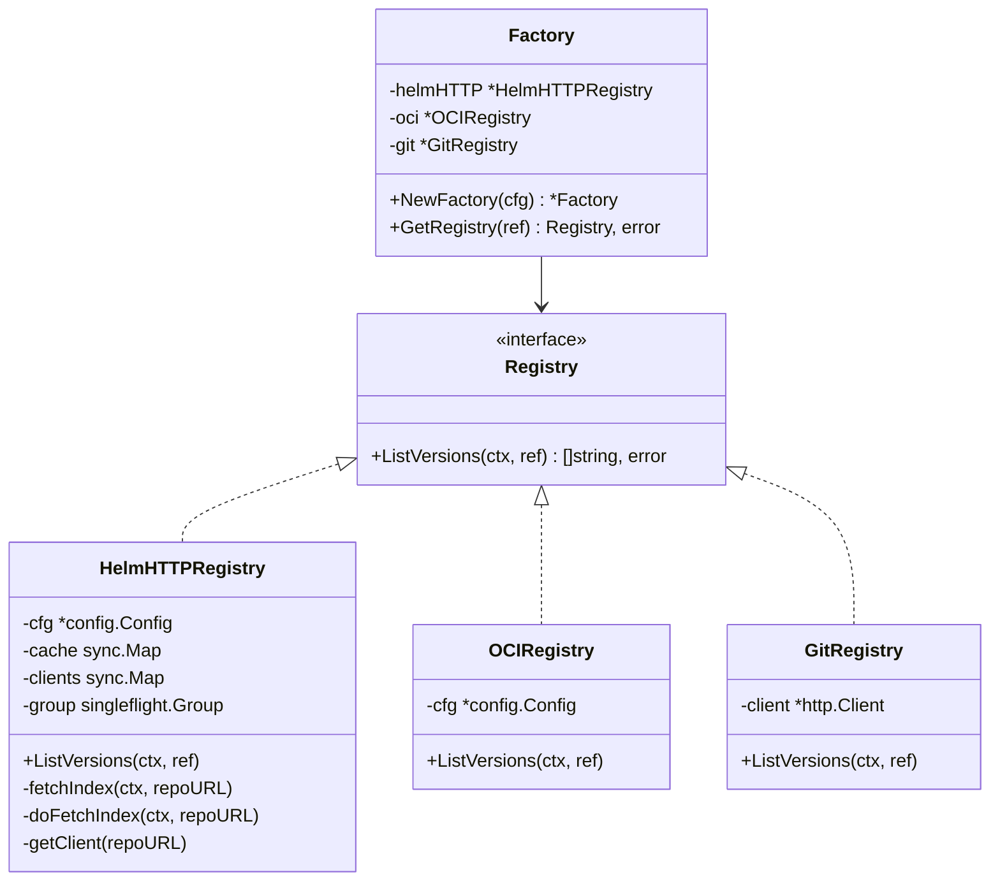

# Argoiax Architecture

## Command Structure

```mermaid
graph TD
    root["rootCmd<br/><i>cmd/root.go</i>"]
    scan["scanCmd<br/><i>cmd/scan.go</i>"]
    update["updateCmd<br/><i>cmd/update.go</i>"]
    version["versionCmd<br/><i>cmd/version.go</i>"]

    root --> scan
    root --> update
    root --> version

    opts["<b>opts struct</b> (cmd/root.go)<br/>cfgFile · scanDir · dryRun · logLevel · chartFilter<br/>outputFormat · showUpToDate<br/>allowMajor · maxPRs · githubToken · repoSlug"]
    root -. "all flags bound to" .-> opts
```

## Scan Flow

```mermaid
flowchart TD
    A["config.Load(opts.cfgFile)"] --> B[scanRefs]
    B --> C["checkVersions<br/><b>concurrent: semaphore=10</b>"]
    C --> G1["goroutine 1"]
    C --> G2["goroutine 2"]
    C --> GN["goroutine N"]
    G1 & G2 & GN --> D[resolveLatest]
    D --> E["factory.GetRegistry()"]
    E --> F["reg.ListVersions()"]
    F --> H["semver.LatestStable()"]
    H --> I["DriftResult[]"]
    I --> J["Renderer.Render()"]

    style C fill:#e6f3ff,stroke:#4a90d9
```

## Update Flow

```mermaid
flowchart TD
    A["config.Load(opts.cfgFile)"] --> B[scanRefs]
    B --> C{for each ref}
    C --> D[resolveLatest]
    D --> E{version == current?}
    E -- yes --> C
    E -- no --> F{major bump &<br/>!allowMajor?}
    F -- yes, skip --> C
    F -- no --> DUP

    DUP["<b>Early PR dup check</b><br/>pr.RenderTemplate() → branch<br/>prCreator.ExistingPR(branch)"]
    DUP --> DUPQ{PR exists?}
    DUPQ -- yes, skip --> C
    DUPQ -- no --> G

    G["fetchNotes()"] --> H["semver.DetectBreaking()"]
    H --> I{dryRun?}
    I -- yes --> J[print dry-run message]
    J --> C
    I -- no --> K["os.ReadFile → updater.UpdateBytes()"]
    K --> L["prCreator.CreatePR()"]
    L --> C

    style DUP fill:#e6ffe6,stroke:#4a9960
```

## Package Dependencies

```mermaid
graph LR
    subgraph cmd
        root[root.go]
        scan[scan.go]
        update_cmd[update.go]
        common[common.go]
    end

    subgraph pkg/registry
        Factory
        HelmHTTP["HelmHTTPRegistry<br/><b>+ clients cache</b>"]
        OCI[OCIRegistry]
        Git["GitRegistry<br/><b>no config param</b>"]
    end

    subgraph pkg/semver
        LatestStable
        DetectBreaking["DetectBreaking<br/><b>off-by-one fixed</b>"]
        IsMajorBump
    end

    subgraph pkg/pr
        RenderTemplate["RenderTemplate<br/><b>exported</b>"]
        GitHubCreator
    end

    subgraph pkg
        config[config.Load]
        manifest[manifest.Walker]
        output[output.Renderer]
        releasenotes[releasenotes.Orchestrator]
        updater[updater.UpdateBytes]
    end

    scan & update_cmd --> common
    common --> Factory
    common --> LatestStable
    Factory --> HelmHTTP & OCI & Git
    update_cmd --> RenderTemplate
    update_cmd --> GitHubCreator
    update_cmd --> releasenotes
    update_cmd --> DetectBreaking
    update_cmd --> updater
    scan --> output
    scan & update_cmd --> config
    common --> manifest
```

## Registry Detail

```mermaid
classDiagram
    class Registry {
        <<interface>>
        +ListVersions(ctx, ref) []string, error
    }

    class Factory {
        -helmHTTP *HelmHTTPRegistry
        -oci *OCIRegistry
        -git *GitRegistry
        +NewFactory(cfg) *Factory
        +GetRegistry(ref) Registry, error
    }

    class HelmHTTPRegistry {
        -cfg *config.Config
        -cache sync.Map
        -clients sync.Map
        -group singleflight.Group
        +ListVersions(ctx, ref)
        -fetchIndex(ctx, repoURL)
        -doFetchIndex(ctx, repoURL)
        -getClient(repoURL)
    }

    class OCIRegistry {
        -cfg *config.Config
        +ListVersions(ctx, ref)
    }

    class GitRegistry {
        -client *http.Client
        +ListVersions(ctx, ref)
    }

    Factory --> Registry
    Registry <|.. HelmHTTPRegistry
    Registry <|.. OCIRegistry
    Registry <|.. GitRegistry
```
