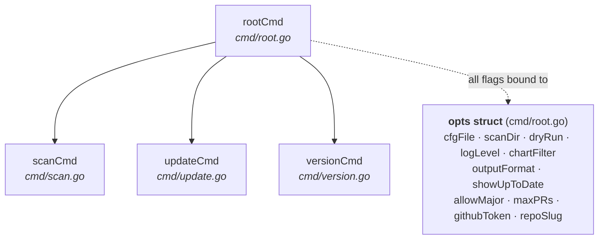
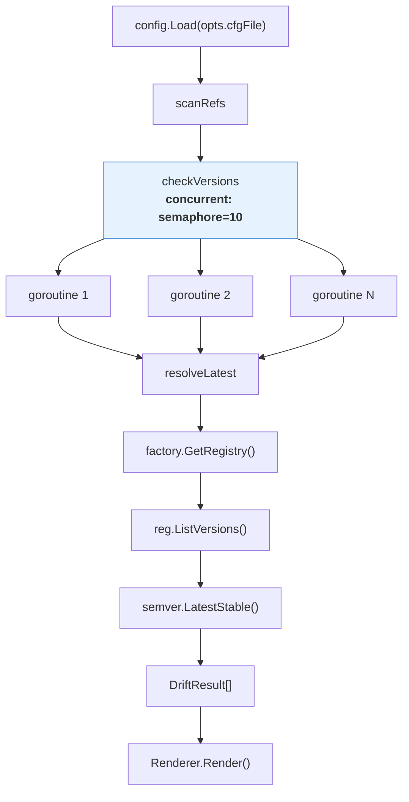
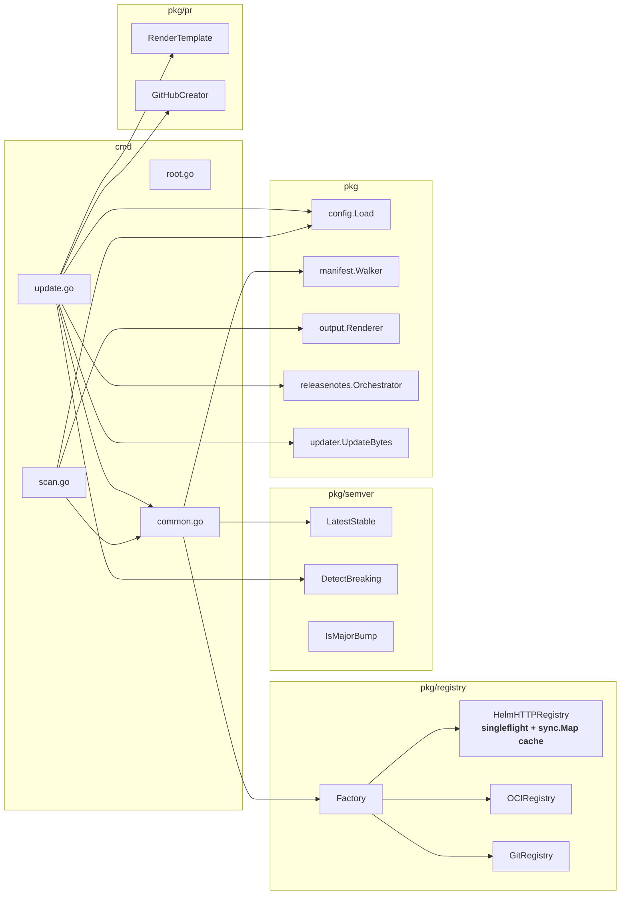
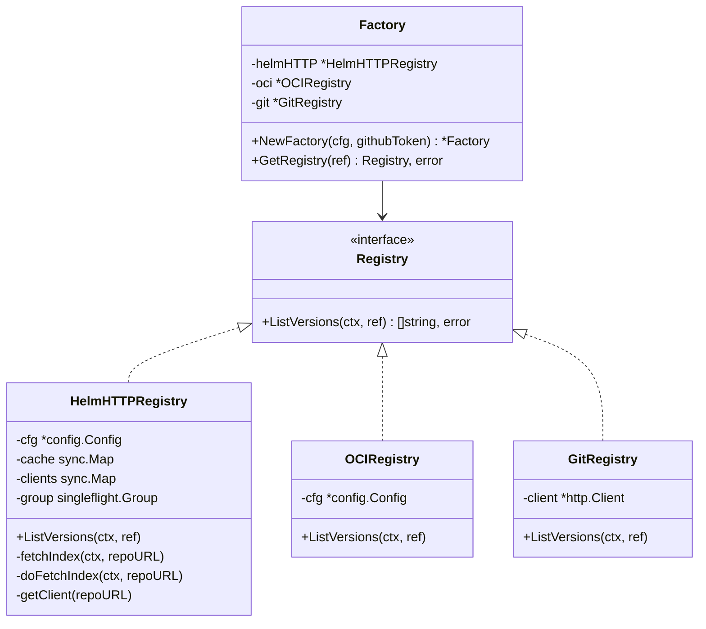
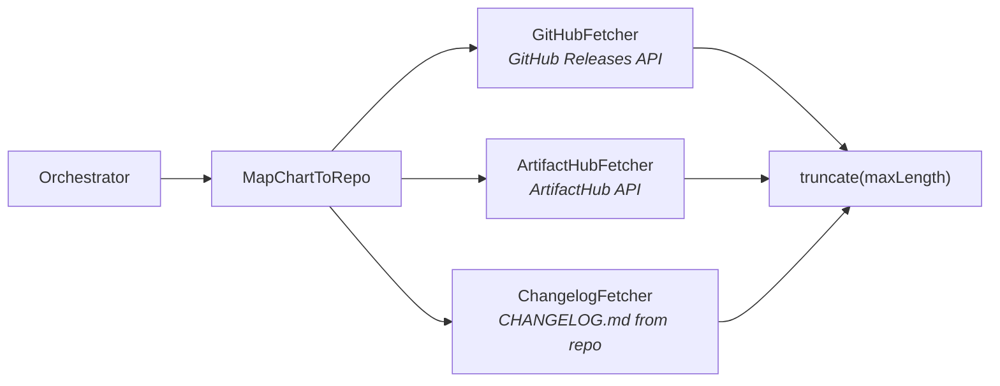
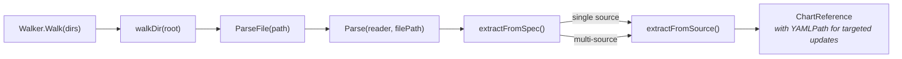

# Argoiax Architecture

## Overview

Argoiax is a CLI tool that scans GitOps repositories for ArgoCD Application/ApplicationSet manifests, detects outdated Helm chart versions across HTTP, OCI, and Git registries, and opens Dependabot-style PRs with release notes and breaking change detection.

**~2,500 lines of production code** across 8 packages with a strict acyclic dependency graph.

## Command Structure

## Scan Flow

The `scan` command parallelizes version resolution using a weighted semaphore (max 10 concurrent goroutines).

## Update Flow

The `update` command processes chart references sequentially. It performs an early PR dedup check before doing expensive work (release notes, breaking change analysis).

## Package Dependencies

All dependencies flow left-to-right, from `cmd` layer to `pkg` packages. No circular dependencies exist.

## Registry Detail

Three registry implementations share a common `Registry` interface. The `Factory` dispatches based on `ChartReference.Type`.

### Registry concurrency model

- **HelmHTTPRegistry** uses `singleflight.Group` to dedup concurrent fetches for the same repo index, a `sync.Map` to cache parsed index data, and a separate `sync.Map` for per-repo authenticated HTTP clients. The winning goroutine's context is detached via `context.WithoutCancel` so cancellation of one caller doesn't affect others.
- **OCIRegistry** delegates to `crane.ListTags` with the default keychain for authentication.
- **GitRegistry** paginates through the GitHub tags API (100 per page).

## Release Notes Pipeline

The orchestrator tries each source in configured priority order, stopping at the first that returns results.

- **GitHubFetcher** tries multiple tag patterns per version: `{version}`, `v{version}`, `{repo}-{version}`
- **ArtifactHubFetcher** tries common package path patterns: `helm/{repo}/{repo}`, `helm/{owner}/{repo}`
- **ChangelogFetcher** tries `CHANGELOG.md`, `changelog.md`, `CHANGES.md`, `HISTORY.md` on `main`/`master` branches, then extracts version sections via regex
- **MapChartToRepo** resolves chart → GitHub repo using explicit config overrides, then heuristics (GitHub Pages URLs, GHCR paths, direct GitHub URLs)

## Manifest Parsing

The `manifest` package walks directories, filters by ignore patterns, and extracts `ChartReference` structs from ArgoCD CRDs using the `yaml.Node` API for precise YAML path tracking.

Supported resource types:
- `Application` → `spec.source` / `spec.sources[]`
- `ApplicationSet` → `spec.template.spec.source` / `spec.template.spec.sources[]`

Skipped references: non-semver targetRevision, Go template expressions (`{{...}}`), ref-only sources (values references).

## YAML Update Strategy

The `updater` package uses AST-based mutation:
1. Decode all YAML documents in the file
2. Navigate to the target node via the dot-separated `YAMLPath` (supports array indexing like `sources[0]`)
3. Verify the current value matches, then replace
4. Re-encode all documents

**Note:** Re-encoding with `yaml.NewEncoder` may alter formatting (comments, blank lines, quoting style) beyond the targeted field.

## Configuration

`config.Load` reads `argoiax.yaml`, expands environment variables (`${VAR}`), unmarshals into the `Config` struct, and validates. If the default config file is missing, sensible defaults are used.

Key design choices:
- **Chart lookup** supports both plain `name` and `repoURL#name` keys for disambiguation
- **Auth config** supports basic auth for HTTP repos and provider-based auth for OCI registries
- **PR settings** are template-driven (Go `text/template`) for branch names and titles

## PR Creation

`GitHubCreator.CreatePR` performs these steps atomically where possible:
1. Render branch name from template
2. Create branch from base ref
3. Get existing file SHA
4. Commit updated file content
5. Create pull request
6. Add labels (including `breaking-change` if applicable)

On failure at steps 3-5, the branch is cleaned up via `deleteBranch`. The `ExistingPR` check runs early in the update loop to avoid duplicate work.

## Test Coverage

Tests exist for pure logic packages:

| Package | Test file | What's covered |
|---------|-----------|----------------|
| `config` | `config_test.go` | Load, defaults, validation, LookupChart |
| `manifest` | `parser_test.go` | All ArgoCD resource types, multi-doc, edge cases |
| `output` | `table_test.go` | Table/JSON/Markdown rendering, filtering, summary |
| `pr` | `body_test.go` | PR body rendering with breaking changes, release notes |
| `registry` | `helm_http_test.go` | Index fetching/caching with httptest server |
| `releasenotes` | `repomap_test.go` | Chart-to-repo heuristic mapping |
| `semver` | `semver_test.go`, `breaking_test.go` | Version comparison, constraint filtering, breaking detection |
| `updater` | `updater_test.go` | YAML path navigation, version replacement |

Not yet covered: `cmd/` (CLI integration), `registry/{oci,git,auth}.go`, `releasenotes/{github,artifacthub,changelog}.go`.

## Known Limitations

- **PR strategies `per-file` and `batch`** are accepted in config but not yet implemented; only `per-chart` is active
- **Update loop is sequential** — unlike `scan`, the `update` command does not parallelize version resolution or release notes fetching
- **YAML re-encoding** may introduce formatting changes beyond the targeted field
- **Glob `**` patterns** in ignore config use a simplified matcher that may not handle all doublestar patterns correctly
- **Branch name sanitization** is not performed — invalid git ref characters in chart names or versions will cause branch creation errors
- **GitRegistry** only supports GitHub; GitLab/Bitbucket repos are not handled
